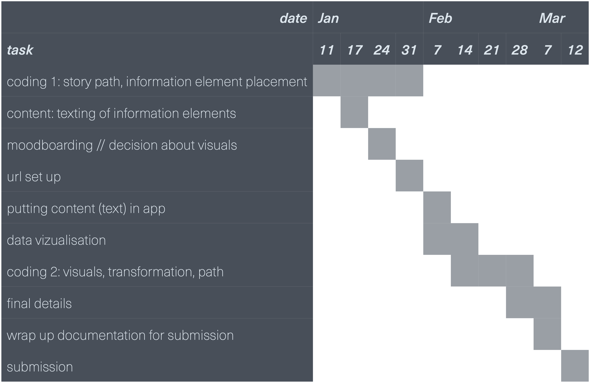

# project plan submission

Johanna Hartmann - first term project

# 1. project description

My first semester project is an interactive visualisation of a case of algorithmic bias. The case is the Arabic dialect recognition algorithm for refugees, which is part of the identity management system of the BAMF and used to verify region of origin for refugees (AlgorithmWatch, 2020; Biselli, 2018; Bundesamt für Migration und Flüchtlinge, 2019; Bundesamt für Migration und Flüchtlinge 2020 ). I will visualise the case on a website, using Vue.js and Three.js. The decision for the case was made in an intensive research process. I chose this particular case because it is a case of a machine learning algorithm used by the German government, which has been used nationwide in Germany since three years (Bundestag-Drucksache 19/6647, 2018). Moreover, the BAMF announced briefely that there are planning a pilot project for using this algorithm in the EU. Since the case is based in Germany, the first case on the website will be aimed at people who live in Germany. Nevertheless, the text will be in English to allow for a wider audience.

The main visual element will be a border / borderline which the user travels along and learns more and more information about the case as he moves. This border will be represented as a path that the user travels along in a 3D space, implemented in Three.js. Along the way, information elements appear or are triggered, presenting different perspectives of the case. 

The information elements will appear in a textual format placed in the 3D world and supported by abstract visuals. The main content will be about the technical details, i.e. how the algorithm works, and on the ethical evaluation of the case. In the best case, the technical explanation will be supported by a visualisation of the speech recognition data. In addition, the information elements address the application and the political process behind the algorithm, since the algorithm comes from the public domain. Since the algorithm is supposed to recognise different Arabic dialects, a linguistic perspective on what it means to have a dialect is also included. It is also very important here to talk about the difference between a language assessor and the algorithm. 

The first semester project will be part of a collection of cases on the website that will follow in the long run. The aim is to explain the algorithmic distinction in an understandable, solution-oriented and impressive way, in order to raise awareness among people without special technical knowledge as well as software developers.

I have implemented a quick, low-level prototype that shows how I could use the boundary as a path for the user:

Prototyp: [https://xd.adobe.com/view/ffa129e2-e39a-40b8-553f-07c8845fd181-8990/?fullscreen](https://xd.adobe.com/view/ffa129e2-e39a-40b8-553f-07c8845fd181-8990/?fullscreen) Passwort: CTech21!

I also vizualized the basic information element flow, so the story line that will be followed.

Content Flow: [https://xd.adobe.com/view/63319de4-2d2d-4937-6dc9-bd59fe6b2183-1500/?fullscreen](https://xd.adobe.com/view/63319de4-2d2d-4937-6dc9-bd59fe6b2183-1500/?fullscreen) 

# 2. scenarios

## 2.1 best case scenario

### content

- decision for one case that is suitable for the application through research of case. Suitable means that the case should be based in Europe,  use Machine Learning and be documented in publications or covered in journalistic texts.
- detailed research about specific case
- website content includes information about different sides of the case in form of information elements:
    - **technical:** how is that working? what data is used? what does the machine learning do?
    - **political:** how was the decision process when deciding on the algorithm? what where the political discussions about it?
    - **applied:** how is it used? how often? in what situations? what is the process behind it? how are the decision makers trained?
    - **ethical:** what are possibilites for discrimination? how fair is the algorithm? how ethical is it to use it at all? what is the difference to a language certificator? (linked with the linguistic side)
    - **linguistic:** how does a dialect develop? what does it mean to have a dialect? what can influence the dialect of a person? (linked with the ethical side)
    - **future:** what should be improved about the case? what does bamf plan to do?

### website

- setup of a single page application with vue
- solid code structure that can be built up on later with other cases (front end)
- use of interactive storytelling
- interaction is in the form of slowly revealing information elements as the user explores website (through clicks, scrolling)
- one line of narration that the user can follow
- integration of audio (e.g. spoken arabic word in different dialects)
- collection of further material and resources so that the user can dive deeper into the topic and read the articles. Those further materials should be available at the end of the story line and as an option at the beginning, so that if a user comes back later, he can look at the resources without needing to go through the story line again
- smooth transitions, animations and interactions
- responsive website
- usage of vue.js and three.js
- one information element is a data vizualization of a potential data set for speech recognition (if possible) or few recording of a voice translated into data (visualised with dimensionality reduction with PCA in 2d or 3d maybe). Since I am not able to have the real data set, it is mainly about showing how speech is translated into data. That speech should ideally be in English or German so the user can understand the examples better. The best case would be to vizualize the same word in different dialects.

### visuals

- aesthetical presentation that supports the message of the case
- design language should be adaptable to other cases as well
- user should see the website as a space, more like a native app without many ui elements
- visual element of the "border" as a base
- use of 3d elements with three js, so that the user travels through the space while getting to know the case more. one the way, more and more text should appear and informations should reveal.
- use of 3d elements with three js, so that the user travels through the space while getting to know the case more. one the way, more and more text should appear and informations should reveal.
- use of effects like parallax to enhance the flowly feel of the website
- illustrations to support the path through the case

## 2.2 worst case scenario

### content

- decision for one case that is suitable for the application through research of case. Suitable means that the case should be based in Europe,  use Machine Learning and be documented in publications or covered in journalistic texts.
- detailed research about specific case
- website content includes information about different sides of the case:
    - **technical:** how is that working?  what does the machine learning do?
    - **political:** how was the decision process when deciding on the algorithm?
    - **applied:** how is it used? how often? in what situations?
    - **ethical:** what are possibilites for discrimination? how ethical is it to use it at all? (linked with the linguistic side)
    - **linguistic:**  what can influence the dialect of a person? (linked with the ethical side)
- collection of further material and resources so that the user can dive deeper into the topic and read the articles

### website

- setup of a single page application with vue
- solid code structure that can be built up on later with other cases
- use of interactive storytelling
- interaction is in the form of slowly revealing informations as the user explores website (through clicks)
- one line of narration that the user can follow
- usage of vue.js

### visuals

- aesthetical presentation
- design language should be adaptable to other cases as well
- user should see the website as a space, more like a native app without many ui elements
- visual element of the "border" as a base
- use of 3d elements with three js, so that the user travels through the space while getting to know the case more. one the way, more and more text should appear and informations should reveal.
- use of effects like parallax to enhance the flowly feel of the website

## 3. timetable

## references

AlgorithmWatch. (2020). Automating Society Report 2020. AlgorithmWatch gGmbH. https://automatingsociety.algorithmwatch.org

Biselli, A. (2018, August 20). Eine Software des BAMF bringt Menschen in Gefahr. Vice. https://www.vice.com/de/article/a3q8wj/fluechtlinge-bamf-sprachanalyse-software-entscheidet-asyl

Bundesamt für Migration und Flüchtlinge. (2019). Digitalisierungsagenda 2020. https://www.bamf.de/DE/Themen/Digitalisierung/Digitalisierungsagenda/digitalisierungsagenda-node.html

Bundesamt für Migration und Flüchtlinge. (2020, October 12). Digitalisierung und Identitätsmanagement im Asylverfahren in Europa [Meldung] https://www.bamf.de/SharedDocs/Meldungen/DE/2020/20201012-digitalisierung-asylverfahren-va-eu-rp.html

Bundestag-Drucksache 19/6647. (2018). Antwort der Bundesregierung auf die Kleine Anfrage der Abgeordneten Ulla Jelpke, Dr. André Hahn, Gökay Akbulut, weiterer Abgeordneter und der Fraktion DIE LINKE. Einsatz von IT-Assistenzsystemen im Bundesamt für Migration und Flüchtlinge.